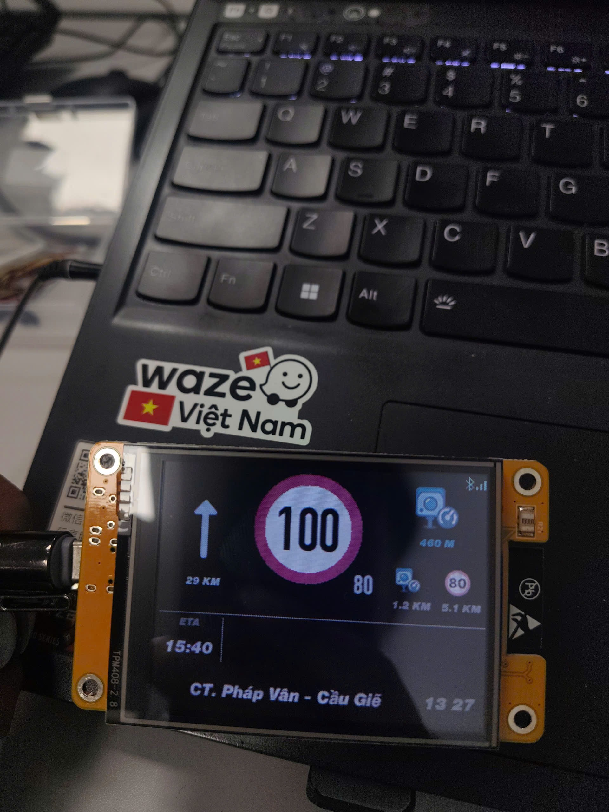
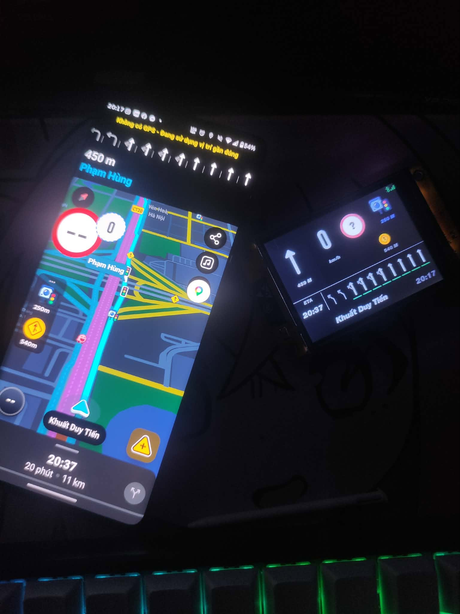

# WazeHUD cho màn hình CYD 2.8 inch

WazeHUD biến mạch ESP32-2432S028 (Cheap Yellow Display) thành màn hình dẫn đường phụ cho ô tô, nhận dữ liệu trực tiếp từ Waze Mod qua Bluetooth Low Energy (BLE).

> [!IMPORTANT]
> Branch này dành riêng cho mạch **ESP32-2432S028 dùng ESP32-WROOM-32 và màn ILI9341**. Không flash firmware này cho các bản CYD dùng ESP32-S3 hoặc controller màn hình khác.

## Hình ảnh thực tế





## Tính năng chính

- Kết nối không dây với Waze Mod qua BLE, tên thiết bị là `WazeHUD`.
- Hiển thị tốc độ xe, biển giới hạn tốc độ, hướng rẽ và khoảng cách tới lượt rẽ.
- Hiển thị cảnh báo chính cùng hai cảnh báo tiếp theo.
- Lane guidance tối đa 10 làn, có đánh dấu làn được khuyến nghị.
- Hiển thị ETA, tên đường tiếng Việt và đồng hồ.
- Hai bố cục tốc độ: ưu tiên tốc độ xe hoặc ưu tiên biển giới hạn.
- Hỗ trợ lật gương để phản chiếu lên kính lái và xoay màn hình 180°.
- Lưu độ sáng, giao diện, bố cục và các thiết lập khác vào bộ nhớ NVS.
- Cập nhật từng vùng thay đổi để giảm độ trễ khi vẽ màn hình.

## Cài firmware nhanh

### Chọn đúng file

Firmware phát hành dùng quy tắc đặt tên:

```text
WazeHUD-<phiên-bản>-WazeMod-<phiên-bản>-<mạch>-<ngày-giờ>-Factory.bin
WazeHUD-<phiên-bản>-WazeMod-<phiên-bản>-<mạch>-<ngày-giờ>-OTA.bin
```

| File | Dùng khi nào | Offset |
|---|---|---:|
| `Factory.bin` | Cài mới, đổi partition hoặc khôi phục mạch | `0x0` |
| `OTA.bin` | Chỉ cập nhật app khi mạch đã có đúng partition table | `0x20000` |

> [!WARNING]
> Không flash file OTA tại `0x0`. Nếu không chắc firmware cũ dùng partition nào, hãy dùng Factory BIN.

### Flash Factory BIN trên Windows

1. Cắm mạch bằng cáp USB có truyền dữ liệu.
2. Mở Device Manager để tìm cổng `USB-SERIAL CH340`, ví dụ `COM12`.
3. Kích hoạt ESP-IDF và flash file Factory:

```powershell
. 'C:\Espressif\tools\Microsoft.v5.5.5.PowerShell_profile.ps1'
esptool.py --chip esp32 --port COM12 --baud 460800 write_flash 0x0 `
  .\WazeHUD-1.0.6-WazeMod-V12-ESP32-2432S028-YYYYMMDD-HHMMSS-Factory.bin
```

Thay `COM12` và tên file bằng giá trị thực tế trên máy.

Nếu mạch không tự vào chế độ flash, giữ nút **BOOT**, nhấn rồi thả **RESET**, sau đó thả **BOOT** và chạy lại lệnh.

## Kết nối với Waze Mod

1. Bật Bluetooth trên điện thoại.
2. Cấp quyền thiết bị ở gần/Bluetooth cho Waze Mod nếu Android yêu cầu.
3. Trong phần HUD Link của Waze Mod, chọn thiết bị `WazeHUD`.
4. Mở một hành trình trong Waze.

Khi kết nối thành công, firmware thương lượng HLP/1 ở tốc độ cập nhật 4 Hz. Không ghép đôi HUD bằng cổng COM Bluetooth của Windows.

## Hiểu trạng thái LED phía sau

| Trạng thái | Màu LED |
|---|---|
| Chưa kết nối điện thoại | Đổi màu RGB liên tục |
| Đã kết nối nhưng chưa có dữ liệu dẫn đường mới | Xanh dương |
| Tốc độ bình thường | Xanh lá |
| Vượt ngưỡng tốc độ | Nháy đỏ 2 Hz |

Tốc độ bằng đúng giới hạn không bị tính là quá tốc. Cảnh báo chỉ bật khi tốc độ xe lớn hơn `giới hạn + offset` đã cấu hình.

## Dùng nút BOOT

Sau khi mạch khởi động xong, nút BOOT có ba thao tác:

| Thao tác | Kết quả |
|---|---|
| Nhấn một lần | Xoay màn hình 180° |
| Nhấn đúp | Bật hoặc tắt lật gương HUD |
| Nhấn giữ | Hiện trạng thái BLE của thiết bị |

Lật gương và xoay 180° hoạt động độc lập, đồng thời được lưu lại sau khi mất nguồn.

## Cấu hình từ Waze Mod

Khi Waze Mod hỗ trợ `device_config`, HUD gửi lên chín thiết lập sau:

| Thiết lập | Giá trị | Ý nghĩa |
|---|---|---|
| Độ sáng | 10–100%, bước 5% | Điều chỉnh đèn nền màn hình |
| Giao diện | Tự động / Ban ngày / Ban đêm | Chọn màu giao diện |
| Hiển thị tốc độ | Tốc độ hiện tại / Biển giới hạn | Chọn thành phần tốc độ chính |
| Hiện tên đường | Bật / Tắt | Ẩn hoặc hiện tên đường |
| Phản chiếu HUD | Bật / Tắt | Lật ngang để phản chiếu kính lái |
| Xoay màn hình | Bật / Tắt | Xoay 180° theo hướng lắp mạch |
| Ngưỡng quá tốc | −10 đến +5 km/h | Bù vào giới hạn trước khi cảnh báo |
| Dịch ngang | −5 đến +5 px | Tinh chỉnh vị trí giao diện |
| Dịch dọc | −5 đến +5 px | Tinh chỉnh vị trí giao diện |

Ở chế độ **Biển giới hạn**, biển báo được phóng lớn làm nội dung chính; tốc độ xe hiện tại xuất hiện nhỏ ở góc dưới-phải của biển.

## Build từ mã nguồn

### Yêu cầu

- ESP-IDF 5.5.5.
- Mạch ESP32-2432S028, flash 4 MB, không có PSRAM.
- Cáp USB dữ liệu và driver CH340 trên Windows.

### Build và flash

```powershell
. 'C:\Espressif\tools\Microsoft.v5.5.5.PowerShell_profile.ps1'
Set-Location D:\Code\WazeHUD\waze-hud
idf.py set-target esp32
idf.py build
idf.py -p COM12 -b 460800 flash monitor
```

Thành phẩm app nằm tại:

```text
waze-hud/build/waze_hud_cyd_28.bin
```

### Chạy giao diện thử không cần điện thoại

Mock mode lần lượt hiển thị các tình huống như rẽ, vòng xuyến, quá tốc, cảnh báo, tên đường dài và lane guidance 10 làn.

```powershell
idf.py -B build-mock `
  -D SDKCONFIG=sdkconfig.mock `
  -D "SDKCONFIG_DEFAULTS=sdkconfig.defaults;sdkconfig.mock.defaults" `
  set-target esp32
idf.py -B build-mock -D SDKCONFIG=sdkconfig.mock build
```

## Thông số phần cứng

| Chức năng | GPIO / thông số |
|---|---|
| LCD | ILI9341, SPI2, 40 MHz |
| MOSI / MISO / SCLK | 13 / 12 / 14 |
| LCD CS / DC | 15 / 2 |
| LCD reset | Nối chung với EN |
| Backlight PWM | GPIO21, active-high |
| LED đỏ / xanh lá / xanh dương | GPIO4 / GPIO16 / GPIO17, active-low |
| Nút BOOT | GPIO0, active-low |
| Độ phân giải | 320×240 landscape |

Màn hình được giữ ở address space gốc 240×320. Firmware xoay các dirty stripe bằng phần mềm sang giao diện landscape 320×240 để màu sắc và chiều hiển thị ổn định giữa các lô CYD.

## Xử lý lỗi thường gặp

| Hiện tượng | Cách kiểm tra |
|---|---|
| Không thấy cổng COM | Đổi cáp USB, cài driver CH340 và thử cổng USB khác |
| Flash không kết nối được | Giữ BOOT, nhấn RESET, thả RESET rồi thả BOOT |
| Màn hình tối | Kiểm tra đúng mạch ESP32-2432S028 và backlight GPIO21 |
| Màu đỏ/xanh bị đảo | Kiểm tra đúng controller ILI9341 và profile BGR |
| Màn hình ngược | Nhấn BOOT một lần hoặc bật cấu hình xoay màn hình |
| Hình bị lật | Nhấn đúp BOOT hoặc tắt `Phản chiếu HUD` |
| Điện thoại không thấy HUD | Kiểm tra LED đang đổi màu, quyền Bluetooth và tên `WazeHUD` |
| Đã kết nối nhưng chưa có dữ liệu | Bắt đầu hành trình trong Waze và kiểm tra LED xanh dương |

## Tài liệu kỹ thuật

- [Chi tiết quá trình port CYD 2.8 inch](./waze-hud/DISPLAY_CYD_28_PORTING.md)
- [Hướng dẫn flash firmware bằng tiếng Việt](./waze-hud/FLASH_FIRMWARE_VI.md)
- [Đặc tả giao thức HLP/1](./waze-hud-link-sdk-ai-bundle.md)

## Cấu trúc mã nguồn

```text
waze-hud/main/
├── bluetooth/   # BLE GATT, advertising và reconnect
├── protocol/    # HLP/1 framing, handshake và JSON decoder
├── state/       # Snapshot trạng thái HUD giữa các task
├── display/     # Layout, renderer, font và driver ILI9341
├── config/      # Cấu hình động và lưu NVS
├── system/      # LED RGB, nút BOOT và trạng thái hệ thống
└── assets/      # Ảnh/font đã chuyển thành dữ liệu nhúng
```

BLE callback chỉ đưa dữ liệu vào queue. Việc parse JSON, cập nhật state và truyền ảnh RGB565 tới LCD được thực hiện ngoài callback để tránh làm nghẽn Bluetooth.
