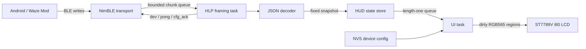

# Waze HUD for LILYGO T-Display-S3

Native ESP-IDF firmware that receives normative HLP/1 navigation snapshots over BLE and renders a low-latency 320×170 automotive HUD on the LILYGO T-Display-S3.

> This target is the 1.9-inch ST7789V T-Display-S3, not the similarly named AMOLED or S3 Pro boards. The pin map and panel sequence are intentionally board-specific. Physical display orientation, color order, BLE interoperability, and long-duration thermal/power behavior still require validation on the target board.

## Build and flash

Prerequisites:

- ESP-IDF 5.5.5
- A non-AMOLED LILYGO T-Display-S3
- A data-capable USB-C cable

From an activated ESP-IDF shell:

```bash
idf.py set-target esp32s3
idf.py build
idf.py -p PORT flash monitor
```

On this Windows workstation, activate the installed environment first:

```powershell
. 'C:\Espressif\tools\Microsoft.v5.5.5.PowerShell_profile.ps1'
cd D:\Code\WazeHUD\waze-hud
idf.py set-target esp32s3
idf.py build
```

The normal build advertises `WazeHUD` and waits for the Waze Mod HUD Link picker to connect. Do not use Bluetooth virtual COM ports for flashing; an attached ESP32-S3 should appear as a USB serial/JTAG device.

## Run the renderer without a phone

Enable **Waze HUD firmware → Enable renderer mock mode** in `idf.py menuconfig`, then build normally. Mock mode disables BLE input and cycles eight deterministic states including lane guidance, minimum speed, alerts, a no-passing zone, overspeed, roundabout, disconnect, and a long Vietnamese street name.

For a separate command-line mock build without changing the production `sdkconfig`:

```powershell
idf.py -B build-mock `
  -D SDKCONFIG=./sdkconfig.mock `
  -D "SDKCONFIG_DEFAULTS=sdkconfig.defaults;sdkconfig.mock.defaults" `
  set-target esp32s3
idf.py -B build-mock -D SDKCONFIG=./sdkconfig.mock build
```

Mock-only lanes and minimum speed are internal state capabilities. The HLP decoder always clears them because HLP/1 defines no corresponding wire fields.

## Architecture



The callback-to-display path has these boundaries:

| Layer | Responsibility | Allocation policy |
|---|---|---|
| NimBLE transport | GATT service, TX writes, RX notification chunks, advertising restart | Bounded 16-entry event queue |
| HLP framing | LF framing, 512-byte limit, UTF-8 validation and resynchronization | Fixed 512-byte receiver |
| Protocol | Envelope validation, immediate ping/pong, handshake and configuration routing | One long-lived task |
| Decoder | Default semantics, enum normalization, `(sess, ts)` ordering | Temporary cJSON DOM deleted per frame |
| State store | Thread-safe immutable snapshot publication | Fixed-capacity strings and arrays |
| Renderer | Dirty regions, embedded Waze assets, antialiased Vietnamese/font-number rendering | One 26.6 KB internal DMA buffer |
| Display | ST7789V i80 transfer, landscape transform, PWM backlight | One transfer in flight |
| Configuration | Staged full-form validation and NVS commit before ACK | One bounded transaction |

BLE callbacks only copy bytes or lifecycle events. JSON parsing, configuration storage, and LCD transfers run in separate task contexts.

## Embedded assets and fonts

The firmware uses selected source files from `D:\Code\WazeHUD\assets`:

- Waze maneuver PNGs become 60×60 alpha masks tinted by the active HUD theme.
- Because the source pack has no dedicated keep-left/right PNG, HLP `KEEP_LEFT/KEEP_RIGHT` use the closest Waze branch assets `exit_left/exit_right` before any procedural fallback.
- Alert PNGs become RGB565 plus alpha at 44×44 and 26×26.
- HLP camera enum `2` uses `fallbacks/penalty_camera.png` as its subtype-neutral fallback.
- Known speed limits use `speedLimit/speed_limit_<value>.png` at 56×56, 44×44, and 26×26.
- HLP `lim=0` renders `speedLimit/no_speed.png` at 56×56 instead of hiding the current-limit region.
- `App/boot_icon.png` is edge-background-keyed and embedded at 96×96 for the left-aligned boot/connection screen.
- `font_number.ttf` (TGL Engschrift) supplies dynamic speed and road-sign numerals.
- `font_text.otf` supplies antialiased labels and the complete precomposed Vietnamese alphabet.

PNG and font decoding never occurs on the ESP32. Generated C++ is checked in at
`main/assets/generated_assets.cpp`, so the normal ESP-IDF build has no Pillow dependency. To regenerate after changing the source pack, run:

```powershell
& 'C:\Users\admin\.cache\codex-runtimes\codex-primary-runtime\dependencies\python\python.exe' `
  .\tools\generate_embedded_assets.py
```

For speed values present in `assets/speedLimit`, the renderer uses the generated sign asset. An unknown value falls back to the dynamic circle-and-number primitive, so legitimate future limits are never hidden.

## Hardware binding

The driver follows LILYGO's official T-Display-S3 definitions and ESP-IDF example:

| Signal | GPIO |
|---|---:|
| Peripheral power | 15 |
| Backlight PWM | 38 |
| LCD reset | 5 |
| LCD CS / DC / WR / RD | 6 / 7 / 8 / 9 |
| LCD D0–D7 | 39 / 40 / 41 / 42 / 45 / 46 / 47 / 48 |

The ST7789V uses an 8-bit i80 bus at 10 MHz. Initialization enables inversion, swaps XY, mirrors Y for landscape with USB on the left, and applies a `(0, 35)` panel gap. Sources: [LILYGO T-Display-S3](https://github.com/Xinyuan-LilyGO/T-Display-S3) and [LilyGo-Display-IDF](https://github.com/Xinyuan-LilyGO/LilyGo-Display-IDF).

## Protocol behavior

The supplied `waze-hud-link-sdk-ai-bundle.md` is normative. The implementation uses exactly its BLE UUIDs and HLP/1 fields.

- Device name: `WazeHUD`
- BLE rate request: 4 Hz
- Framing: UTF-8 JSON object plus LF
- Maximum frame: 512 bytes including LF
- Android writes TX with response; firmware notifies RX
- `dev` is sent after RX notification subscription
- `ping` receives an immediate `pong`
- New sessions reset timestamp/state ordering
- Unknown keys and message types are ignored
- Missing state fields use HLP/1 defaults
- `alrs` is explicitly requested and capped at four entries; its `alrs[0]` mirror is removed from the normalized upcoming list
- Equal-distance `SPEED_DROP` alerts are normalized with the higher `v` first while preserving producer near-to-far order for every other case
- Alert UI shows up to two upcoming items; an active `avg=1` no-passing zone takes the dominant slot and reduces the upcoming row to one centered item
- `avg` is rendered as a Vietnamese no-passing zone, never as an average-speed camera

The state decoder supports `nav`, `spd`, `lim`, `over`, `trn`, `trn2`, `dst`, `exit`, `st`, `st2`, `eta`, `rmin`, `rkm`, `avg`, `avgL`, `avgR`, `avgP`, `alr`, `alrD`, `alrV`, `alrs`, and `ts`.

## Configure the device from Waze

When the producer advertises `device_config`, the HUD publishes five controls:

| ID | Type | Validation |
|---|---|---|
| `brightness` | Slider | 10–100 in steps of 5 |
| `theme` | Selection | `auto`, `day`, or `night` |
| `show_street` | Toggle | Boolean |
| `offset_x` | Integer | −5 through 5 |
| `offset_y` | Integer | −5 through 5 |

The firmware stages every value, rejects missing/duplicate/unknown IDs, persists the complete candidate to NVS, increments the schema revision, and only then sends a successful `cfg_ack`. A repeated commit receives the previous transaction result instead of applying twice.

## Diagnose hardware

Useful production log tags are `APP`, `DISPLAY`, `BLE`, `HLP`, `STATE`, and `CONFIG`.

| Symptom | Check |
|---|---|
| LCD remains dark | Confirm this is the ST7789V T-Display-S3 and GPIO15 is driven high |
| Wrong orientation | Confirm USB connector is on the left; the alternate physical orientation needs mirror adjustment |
| Red and blue swapped | Verify `swap_color_bytes` and RGB endian behavior on the physical panel revision |
| Phone cannot discover HUD | Confirm NimBLE is enabled and the HLP service UUID is advertised |
| Connects but no state | Confirm Android enabled RX notifications and logs show `dev` then `hi` |
| `FRAME_TOO_LARGE` behavior | Send more than 511 payload bytes followed by LF and confirm the next valid line is accepted |
| Street glyph issue | Capture the UTF-8 code point; the generated font includes the complete precomposed Vietnamese alphabet |

## Build evidence

The production configuration was compiled locally with ESP-IDF 5.5.5 and `idf.py set-target esp32s3 && idf.py build`. With embedded image and font data, the application binary is `0xf5e10` bytes, leaving 68% of each 3 MB OTA slot available. Display initialization, BLE discovery, MTU negotiation, HLP handshake, dynamic configuration, live `st` street data, and sustained state/heartbeat operation were exercised on the attached T-Display-S3 and Waze producer.
